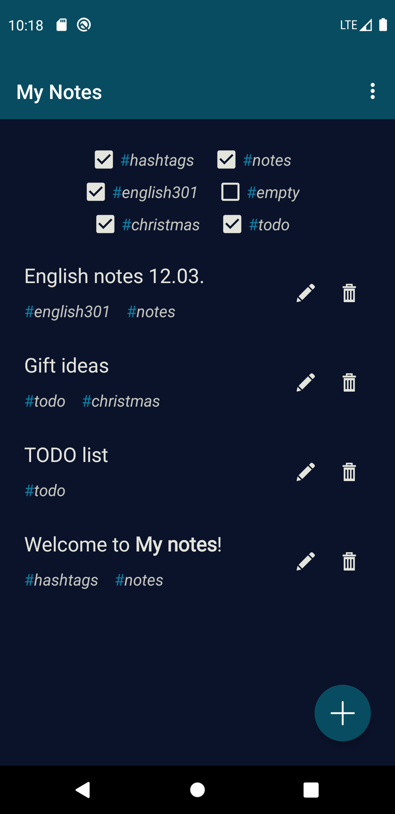
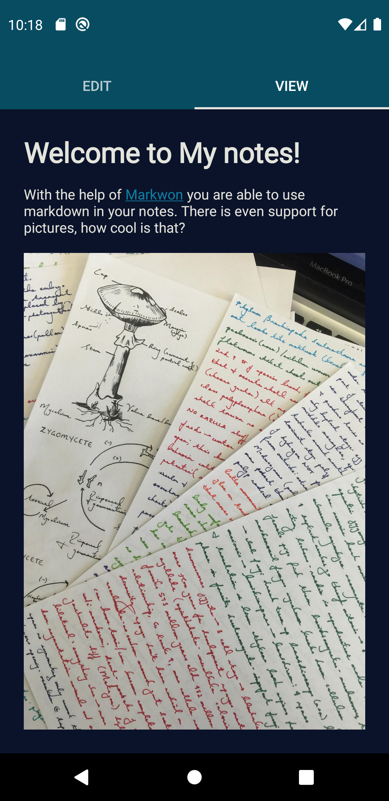

# MyNotes
> My homework for BME's Android and web development course.

A basic android app for creating and filtering notes written in markdown.
The app's main functionality comes from [Markwon](https://github.com/noties/Markwon).

 

The project specification can be read _(in hungarian)_ [here](resources/specification.pdf).
